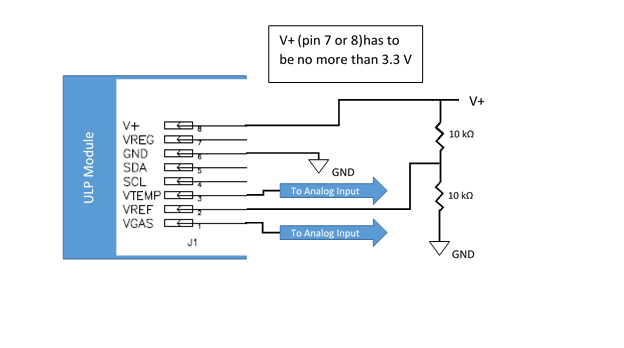

# ULPSM
## Public Arduino Library for ULPSM (ultra-low power sensor module) or SDK (sensor development kit)

##### Included in this repository are a diagram of optional hook up, and instructions for reducing noise in the signals.

**Notes and suggestions for Arduino library:**

  1. We recommend users work with the Evaluation Board the ULPSM plugs into, that comes with the sensor development kit. However, some have purchased only the ULPSM and so hooking the Vref and Vtemp directly to an ADC is not recommended. There are two options to overcome the noise on those lines:
        1. **Option A** Use an voltage follower (instrumentation OpAmp) to buffer the signals  (wikipedia: Buffer amplifier).
        2. **Option B** Use this diagram, which shows how to avoid having to use a opamp filter to read Vref and Vtemp. This 2x 10 kOhm voltage ladder increases the current considerably, since the internal voltage ladder is 2x 1MOhm resistors. But for some applications this will also decrease the noise considerably. 

  2.  Before using temperature compensation look at the signal without compensation. The compensation algorithms are for health and safety levels only. For measuring air quality (low levels) the final temperature compensation will depend on many factors of your iplementation. Please contact SPEC sensor for advice on Air Quality temperature calibration for final implementation.

  3.  In the implementation of temperature compensation, be sure to pass the function a float value. If you pass an integer or a rounded float value, you will see large jumps in the concentration whenever the value changes, ie. from 24 C to 25 C.

  4.  Using Arduino's with various power supplies:  It appears some Arduinos will provide variable voltage to the ADC reference voltage, for instance a 5 volt Arduino can measure a 3.3 volt analog input as anywhere from 3.32 to 3.15 depending on the power supply. The recomendation is to use analogReference(EXTERNAL) early in the setup function, and run a wire from the input of the analog sensors (3.3 V rail of arduino) to Aref of the arduino. This could fix the variablity of the arduino ADC.  Slight variation can be seen from some power supplies that may pass small AC voltages to the arduino, this could cause a few hundred ppb shift when changing power supplies of the arduino.

**== License==**

Maybe but maybenot.

This library is free software; you can redistribute it and/or
modify it under the terms of the GNU Lesser General Public
License as published by the Free Software Foundation; either
version 2.1 of the License, or (at your option) any later version.

This library is distributed in the hope that it will be useful,
but WITHOUT ANY WARRANTY; without even the implied warranty of
MERCHANTABILITY or FITNESS FOR A PARTICULAR PURPOSE. See the GNU
Lesser General Public License for more details.

You should have received a copy of the GNU Lesser General Public
License along with this library; if not, write to the Free Software
Foundation, Inc., 51 Franklin St, Fifth Floor, Boston, MA 02110-1301 USA
